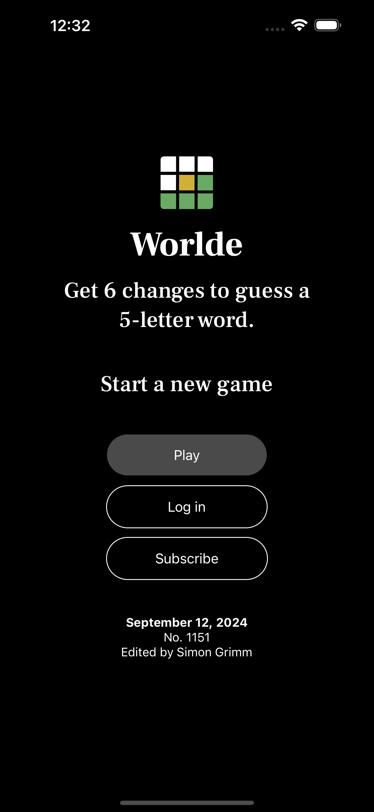
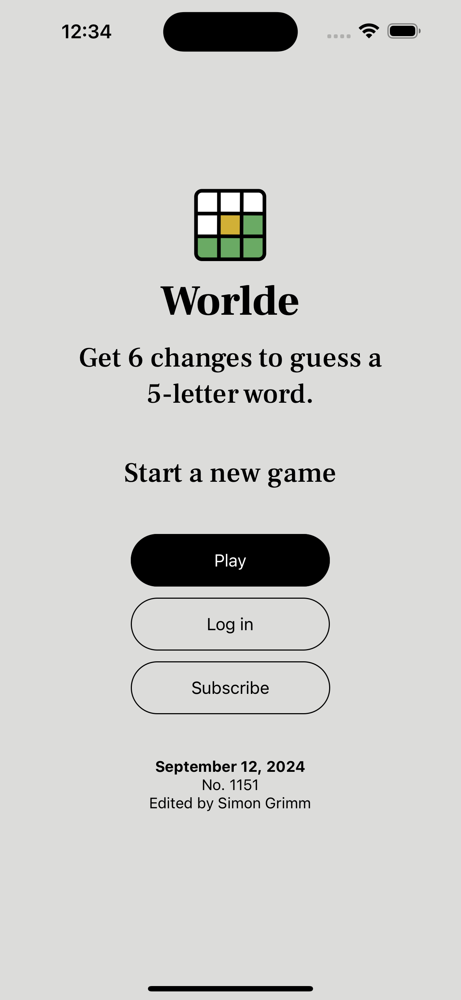
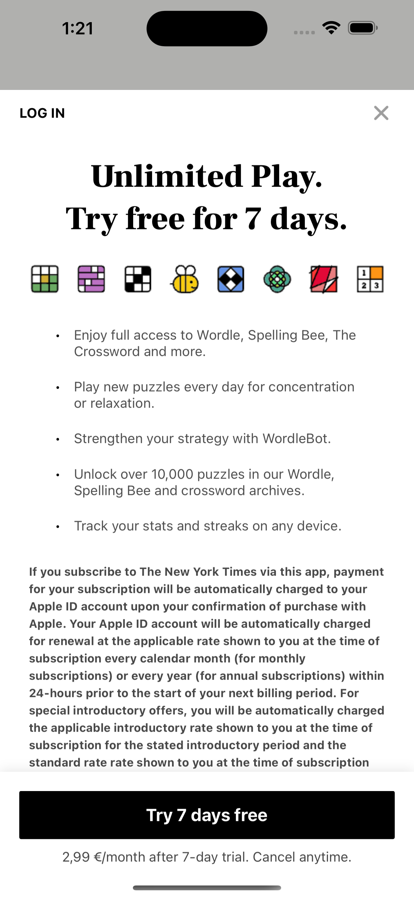
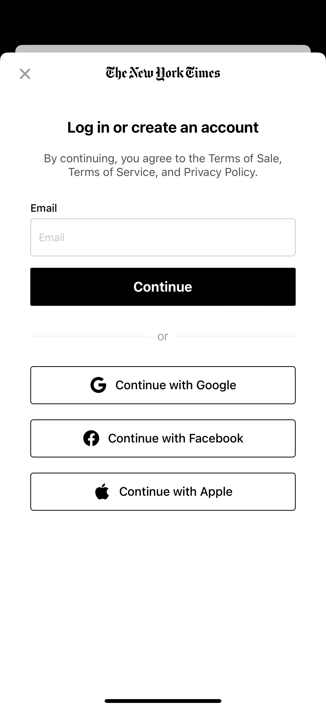

# Wordle Clone

Wordle Clone is a clone of the popular wordle game. This application has been created using React Native and Expo "create-expo-app" command. The motive of this application is to learn about

- React Native and Expo with Prebuild
- Expo Router
- Light and Dark Mode
- SVG Support in React Native
- Loading Custom Fonts (Here Google Fonts)
- Bottom Sheet Modal
- Clerk For Authentication Flow

and many more.

## Screenshots

This project will get more updates as commit.